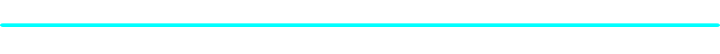

  
  
  <h1 style="font-size: 40px;"></h1>
  
  

    
  

  
  
  

### 🕹️ PLAYER---SELECT: **[ace4o4]**

> *"Code is the architecture of the imagination."*

I am a **Level 25 Full Stack Developer** specializing in creating immersive, physics-based UI/UX and cross-platform experiences.
Currently unlocking new skill trees in **Cyber Security** and **Artificial Intelligence** systems. My code doesn't just run; it *evolves*.

### 🛸 CURRENT MISSIONS (Active Projects)

| Mission ID | Objective | Tech Stack | Status |
|:---:|:---|:---|:---:|
| **[Memo-Drift](https://github.com/RaoSam-Code/memory-drift)** | **Physics-Based Memories** Floating notes using Matter.js engine. | `React` `TS` `Physics` | 🟢 Online |
| **[Nexus]** | **Social Grid** Activity-based connection matrix. | `Node` `Graph` `Real-time` | 🟡 Loading... |
| **[Web3](https://github.com/RaoSam-Code/apt)** | **Chain Link** Gasless transaction protocol. | `Aptos` `Move` `Crypto` | 🔵 R&D |

### ⚔️ WEAPONRY (Tech Stack)

| **Languages** | **Frameworks & Libs** | **Cloud & Database** | **DevOps & Tools** |
|:---:|:---:|:---:|:---:|
|  |  |  |  |

 

<!-- Additional Badges for specific tech -->

### 📊 BATTLE STATS

  <!-- Profile Details (Fast load) -->
  

 

  <!-- Languages & Productive Time -->
  

  

 

### 📡 TRANSMISSION CHANNELS

 
 

  <i>SYSTEM LOG: END OF FILE. USER DISCONNECTED.</i>

